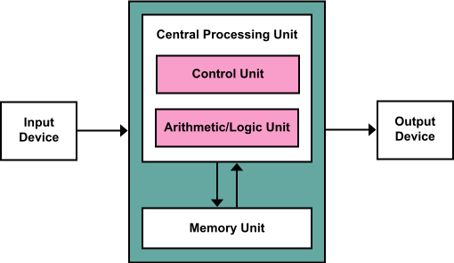
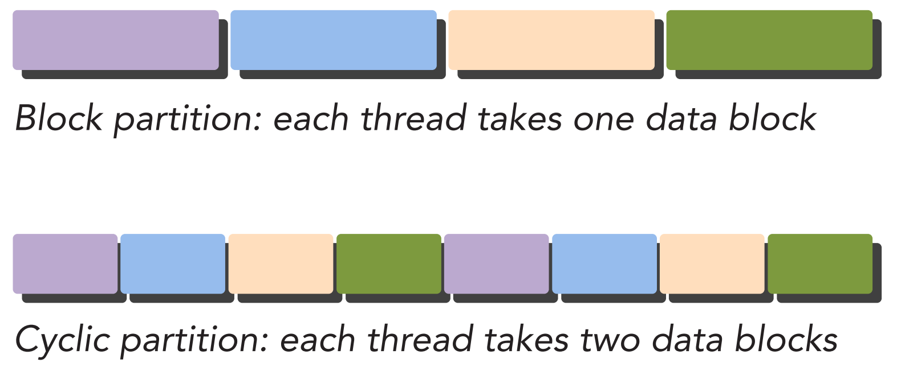

# Chapter 1 - 异构编程

目录

- [并行计算](#并行计算)
- [计算机体系结构](#计算机体系结构)
- [并行编程](#并行编程)
- [参考](#参考)

## 并行计算

在传统的编程模型中，程序是一个指令的序列，它们运行在**中央处理器**(*central processing unit*, *CPU*)上的一个核心上，从头到尾，顺序执行。随着硬件的发展，CPU有了越来越多的核心，多个计算机又可以组成计算**集群**(*cluster*)，顺序执行的代码无法再充分的利用计算机的全部计算性能，**并行计算**(*parallel computing*)开始浮现。

在并行计算中，多个计算任务同时执行，不同计算任务的程序指令不再保持顺序，仅在某些必要的时候进行**同步**(*synchronize*)。最常见的方式是，一个**进程**(*process*)使用多个**线程**(*thread*)在CPU上同时执行任务，这称作**多线程**(*multi-thread*)技术。时至今日，多线程技术已经被广泛应用在各种软件之中，例如部署在服务器上网站后台软件常常需要开启数百个线程对来自互联网数据访问进行处理。

然而，一个CPU的核心数常常只有数个或数十个，即使是具有**超线程**(*hyper-threading*)技术的CPU，其物理线程也止步于核心数的两倍。这使得运行在单个CPU上的线程数非常有限，在CPU上运行的计算任务往往只能够粗粒度的分解，比如一个线程接受一个来自网络的访问会话，一个线程处理一幅图像，或者是一个线程处理用户界面交互另一个线程处理底层运算、IO。

而**图形处理单元**(*graphics processing unit*, *CPU*)也就是**显卡**的快速发展，赋予了并行计算另一种方式。现代的GPU常常具有数以千计的物理线程，这意味着在同一时间，可以由数以千计的线程同时运行，程序的细粒度分解成为了可能，例如一个线程仅处理图像的一个像素，或者一个线程仅处理光滑流体动力学(*Smoothed Particle Hydrodynamics*, *SPH*)的一个粒子。

CPU和GPU不同的体系结构，为不同的并行任务提供了硬件基础，而不同的编程方式为并行计算提供软件了支持。

## 计算机体系结构

现代计算机的体系结构的基础是**冯·诺依曼结构**(*von Neumann Architecture*)，它包含五个部分，**控制单元**(*control unit*, *CU*)，算数与逻辑单元(*arithmetic and logical unit*, *ALU*)，**存储器**(*memory*)和**输入输出**(*input/output*, *I/O*)，CU和ALU通常合在一起，称为CPU。

程序的数据和指令存储在存储器中。在执行程序时，控制单元将指令和数据从存储器中读出，并对指令进行解析，然后交由算数与逻辑单元计算。在执行时，指令存储在CU的**指令寄存器**(*instruction register*, *IR*)中，下一条指令的地址存储在CU的**程序计数器**(*program counter*, *PC*)中，它也常被称为**指令指针**(*instruction pointer*, *IP*)。在ALU中，
然后将计算的结果写回存储单元。CU与ALU通常合在一起，称为CPU。

> 图 von Neumann Architecture
> 
> 

计算机体系结构有多种归类方式，最广为使用的是**费林分类法**(*Flynn's Taxonomy*)。它根据指令流和和数据流，将体系结构分为四类：

- 单指令单数据(SISD)
- 单指令多数据(SIMD)
- 多指令单数据(MISD)
- 多指令多数据(MIMD)

SISD对应着传统的单核CPU。

为了优化顺序执行的代码、实现计算机必要的控制逻辑和输入输出的管理，现代的CPU中的控制单元十分复杂。

## 并行编程

常见的并行编程方式有两种：
- **任务并行**(*task parallel*)
- **数据并行**(*data parallel*)

当我们解决问题时，最朴素的想法是将这个大问题分解为若干个小**任务**(*task*)，每个任务接受输入、执行计算、产生输出。其中，一些任务的输入来自于其他的任务输出，那么就称它们之间存在数据依赖关系，因此必须顺序执行。而那些没有数据依赖的任务，则可以同时执行。例如，在下面的任务关系中，任务B和C都的输入都依赖于A的输出，因此他们必须在A的后面执行。而B和C之间则没有依赖关系，因此在A完成后，B和C可以同时执行。最后的任务F依赖于D和E，因此必须要在所有任务完后之后，才能执行。

```plain-text
      B -> D 
     /      \
-> A          F ->
     \      /
      C -> E
```

基于任务上的依赖关系，我们可以让那些可以同时进行的任务并行执行，这称作**任务并行**(*task parallel*)。例如，设计一个聊天软件时，我们既可以用一个线程在每一个周期顺序的处理用户输入、接受网络输入、渲染界面，也可以用三个线程分别对这三个任务进行处理。

在许多应用中，有大量的彼此独立的数据。例如，将一幅彩色图片转化成黑白图片，程序对一个像素的处理并不依赖于其他的像素。这引出了另一种并行方式——**数据并行**(*data parallel*)。

为了设计数据并行程序，首先要将问题按照数据进行分解，将它们分配到不同的线程中。常见的线程分配策略有两种，一种是**块状划分**(block partiion)，一种是**循环划分**(cyclic partion)。以长度为8的一维数组为例，如果我们只有4个线程，块状划分会将每两个连续的数据划分给一个线程，每个线程处理一个块；而循环划分会每个数据依次将划分给一个线程，每个线程处理多个块。

> 图 block partition and cyclic partition
>
> 

## 参考

- [von Neumann architecture - Wikipedia](https://en.wikipedia.org/wiki/Von_Neumann_architecture)
- [AMD Zen Architecture - Wikichip](https://en.wikichip.org/wiki/amd/microarchitectures/zen)