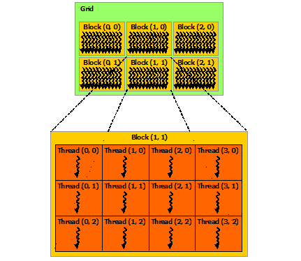

# Chapter 3 - 编程模型

目录

- [异构编程模型](#异构编程模型)
- [线程层次](#线程层次)
- [参考](#参考)

## 异构编程模型

在CUDA编程模型中，程序的运行环境由**主机**(*host*)和**设备**(*device*)两部分组成，也就是CPU和GPU。程序在主机中启动，当主机代码运行到CUDA的并行程序部分时，由主机代码调用运行在设备上的**核函数**(*kernel*)来启动设备代码的执行。因此设备被认为是主机的**协处理器**(*coprocessor*)。

CUDA编程模型假设主机和设备独立维护各自的内存空间，称为**主机内存**(*host memory*)和**设备内存**(*device memory*)。程序通过调用CUDA运行时函数对设备内存进行管理，包括内存分配、释放以及数据传输等。CUDA 6.0版本增加一种新的方式连接主机和设备的内存空间，称作**统一寻址**(*Unified Memory*)，它允许用户使用一个具有共同地址空间的、单一且一致的内存镜像访问所有CPU和GPU上的内存空间，这将在稍后的部分介绍。

下图给出了一个CUDA异构编程的例子。图中，带有波浪线的箭头表示线程。可以看到，在主机中的代码以顺序的方式执行，在主机代码调用在设备上运行的函数`kernel0`和`kernel1`后，主机为设备启动了大量的线程来并行执行这两个核函数。

> 图 heterogeneous programming
>
> 

核函数的语法与C语言中的函数类似，可以通过CUDA C的扩展的语法kernel call`<<<...>>>`进行调用，其中`<<<...>>>`中的内容称为[**执行配置**(*Execution Configuration*)](https://docs.nvidia.com/cuda/cuda-c-programming-guide/index.html#execution-configuration)。

因为数据存放在主机内存中，为了能够让设备对数据进行计算、储存计算结果、并将计算结果返回到主机，主机需要在调用核函数前为设备中的变量分配内存空间，然后将主机中的数据复制到设备空间中，然后才可以调用核函数，并且在调用核函数后，还需要再将设备内存中的数据复制回主机，并对设备内存进行释放。

下面的代码以向量加法为载体展示了核函数的定义以及编程框架。为了方便表示，我们约定，主机变量加以前缀`h_`，设备变量加以前缀`d_`。

```cpp
// kernel definition
__global__ void vec_add(float* A, float* B, float* C)
{
    int i = threadIdx.x;
    C[i] = A[i] + B[i];
}

int main()
{
    ...

    // 1. allocate memory of device and copy data from host to device
    ...

    // 2. kernel invocation with N threads
    vec_add<<<1, N>>>(d_A, d_B, d_C);
    ...

    // 3. copy data back from device, and free memory allocated
    ...
}
```

在代码中，主函数`main`中调用了名为`vec_add`的kernel用于执行向量加法，```<<<...>>>```中的含义为使用`1`个**线程块**(*thread block*)，每个线程块有`N`个线程。

在kernel中，`threadIdx`是CUDA C语言扩展中的一个内置变量，称作**线程索引**(*threadIdx*)表示在一个线程块内的线程在`x,y,z`三个维度的`id`，即一个3维无符号整形向量`uint3`。为了方便在IDE中使用，可以在编写程序时包含头文件`<device_launch_parameters.h>`。

kernel前的`__global__`是一个**函数执行空间限定符**(*[Function Execution Space Specifiers](https://docs.nvidia.com/cuda/cuda-c-programming-guide/index.html#function-declaration-specifiers)*)，用于将函数声明为一个kernel，它表示这个函数在设备中运行，并且，它既可被主机调用，也可以被设备调用。被声明为`__global__`的函数的返回值必须为`void`，并且不可以作为类的成员函数。

以下为CUDA 10.0中所有的函数执行空间限定符：

| FESS | 说明  |
|---|---|
| `__device__`  |  1. 在设备上运行；<br/> 2. 仅可以由设备调用；<br/> 3. `__global__`和`__device__`不可以被用于同一个函数|
| `__global__` | 1. 在设备上运行；<br/> 2. 可以由主机调用； <br/> 3. 在计算能力3.2及以上的设备中，可以由设备调用； <br/> 4. 必须返回`void`且不可以作为类的成员函数； <br/> 5. 任何对`__global__`函数的调用都必须指定它的执行配置；<br/> 6. 对于`__global__`函数的调用是**异步**的，这意味着函数调用会在设备执行完成前返回。
| `__host__` | 1. 在主机上运行；<br/> 2. 仅可以由主机调用；<br/> 3. `__global__`和`__host__`不可以被用于同一个函数；<br/> 4. `__device__`和`__host__`可以用于同一个函数，此时同时编译器会为这个函数生成“主机”和“设备”两个版本，常见于通过宏`__CUDA_ARCH__`对主机代码或设备代码进行条件编译。
| `__noinline__` <br/> `__forceinline__` | 1. 通常，如果设备编译器在编译时会将适合内联的代码自动内联；<br/> 2. `__noinline__`用于提示编译器如果可能的话，不要内联该函数； <br/> 3. `__forceinline__`强制编译器内联该函数；<br/>4. 这两个限定符不能够被同时使用，并且函数**限定符**(*qualifier*)都不可用于内联函数。|

CUDA运行时提供了一组API用于管理主机与设备内存，这里我们采用与C语言中管理内存最接近也是最简单的方式，`cudaMalloc`，`cudaFree`和`cudaMemcpy`对设备内存进行管理，它们分别用于分配、释放内存和对内存进行复制。具体的说明以及更复杂内存管理方式可以参考[Chapter 4](./cuda_04.md#设备内存)。下面的代码展示了`d_A`，`d_B`和`d_C`三个数组的空间分配、内存复制和释放。

```cpp
int main()
{
    const size_t N = 5; // length of array

    ...

    // allocate for arrays on device
    cc(cudaMalloc(&d_A, sizeof(float) * N));
    cc(cudaMalloc(&d_B, sizeof(float) * N));
    cc(cudaMalloc(&d_C, sizeof(float) * N));

    // copy memory from host to device
    cc(cudaMemcpy(d_A, h_A, sizeof(float) * N, cudaMemcpyHostToDevice));
    cc(cudaMemcpy(d_B, h_B, sizeof(float) * N, cudaMemcpyHostToDevice));

    ...

    // copy result from device to host
    cc(cudaMemcpy(h_C, d_C, sizeof(float) * N, cudaMemcpyDeviceToHost));

    // deallocate
    cc(cudaFree(d_A));
    cc(cudaFree(d_B));
    cc(cudaFree(d_C));

    ...

    return 0;
}
```

在上述代码中，可以看到`cudaMallo`和C标准库中的`malloc`有一个显著的不同，后者仅接受一个参数，并将分配的地址作为返回值，而前者则将分配的地址通过函数参数返回。这是因为CUDA运行时API的返回值都是`cudaError_t`类型，用于反馈该函数的调用是否出现错误，如果返回值不为`cudaSuccess`则表示程序运行时出现了异常，我们可以通过函数`cudaGetErrorString`获取该返回值对应的错误信息。为了简化这个错误检查的过程，我们使用了宏`cc`，具体定义参见[附录A](./cuda_appendix_A.md#错误检测-cc)。

需要注意的是，通常情况下，主机启动核函数后，控制权立刻返回到主机，也就是说主机对核函数的调用是**异步**(*asynchronous*)的。CUDA运行时为主机与设备进行同步提供了多种方式，这里我们使用`cudaDeviceSynchronize`函数对主机和设备进行同步。该函数会使主机等待，直到当前设备所有的计算任务均已完成。

向量加法的完整代码如下。

```cpp
#include <cstdint>
#include <iostream>

#include <cuda_runtime.h>
#include <device_launch_parameters.h>

#include "cuda_helper.h"

// kernel definition
__global__ void vec_add(float* A, float* B, float* C)
{
    int i = threadIdx.x;
    C[i] = A[i] + B[i];
}


int main()
{
    const size_t N = 5; // length of array
    float h_A[N] = { 0., 1., 2., 3., 4. };
    float h_B[N] = { 9., 8., 7., 6., 5. };
    float h_C[N];

    float *d_A, *d_B, *d_C;

    // malloc for arrays on device
    cc(cudaMalloc(&d_A, sizeof(float) * N));
    cc(cudaMalloc(&d_B, sizeof(float) * N));
    cc(cudaMalloc(&d_C, sizeof(float) * N));

    // copy memory from host to device
    cc(cudaMemcpy(d_A, h_A, sizeof(float) * N, cudaMemcpyHostToDevice));
    cc(cudaMemcpy(d_B, h_B, sizeof(float) * N, cudaMemcpyHostToDevice));

    // kernel invocation with N threads
    vec_add<<<1, N >>>(d_A, d_B, d_C);

    // waiting until device completes
    cc(cudaDeviceSynchronize());

    // copy result from device to host
    cc(cudaMemcpy(h_C, d_C, sizeof(float) * N, cudaMemcpyDeviceToHost));

    cc(cudaFree(d_A));
    cc(cudaFree(d_B));
    cc(cudaFree(d_C));

    std::cout << "A: ";
    for (int i = 0; i < N; i++)
    {
        std::cout << h_A[i] << " ";
    }
    std::cout << std::endl;

    std::cout << "B: ";
    for (int i = 0; i < N; i++)
    {
        std::cout << h_B[i] << " ";
    }
    std::cout << std::endl;

    std::cout << "C: ";
    for (int i = 0; i < N; i++)
    {
        std::cout << h_C[i] << " ";
    }
    std::cout << std::endl;

    // output should be:
    // A: 0 1 2 3 4
    // B: 9 8 7 6 5
    // C: 9 9 9 9 9

    return 0;
}
```

## 线程层次

前面提到，线程`threadIdx`是一个3维向量，通过设置其维度，可以构成一维、二维或三维的线程块，这提供了一种自然的方式用于计算向量、矩阵或是张量。

线程块的维度用内置变量`blockDim`表示，这是一个三维的无符号整形向量，其类型为`dim3`，也具有`x`，`y`和`z`三个分量，表示线程块对应维度有几个线程。因此，在一个线程块中，`threadIdx={x, y, z}`的线程的是线程块中第`threadIdx.z * blockDim.x * blockDim.y + threadIdx.y * blockDim.x + threadIdx.x`个线程。

进一步的，线程块可以组成**网格**(*grid*)，在网格中，线程块的索引用表示为内置的三维向量`blockIdx`。对应的，网格的维度用三维向量`gridDim`表示。

线程与线程块的排布都是**列主序**(*column Major*)的，即`x`表示在一行中的位置，`y`表示在一列中的位置。如图所示

> 图 grid of thread blocks
>
> 

在计算线程在整个网格中的位置`tid`时，方法如下（以二维为例）：

```cpp
x = blockIdx.x * blockDim.x + threadIdx.x;
y = blockIdx.y * blockDim.y + threadIdx.y;
tid = y * blockDim.x * gridDim.x + x;
```

线程块的执行必须要有独立性，即彼此间没有执行顺序的依赖。它们即应能顺序执行，也能并行执行。这允许线程块可以被以任何顺序、任意核心数量进行调度。

对于一个设备，每个线程块中线程的最大个数是固定的，并且在一个线程块中，每个维度的大小也是有限制，同样，网格的维度也是受限的。这些参数分别对应结构`cudaDeviceProp`中的域`maxThreadsPerBlock`，`maxThreadsDim`和`maxGridSize`。当使用了错误的线程块维度或网格维度进行kernel call时，会得到错误`cudaErrorInvalidConfiguration`。

同属一个线程块内的线程可以通过**共享内存**(*shared Memory*)进行数据共享，也可以通过`__syncthreads()`指令函数进行同步。当块内的线程调用`__syncthreads()`时，它会被阻塞直到块内所有的线程均运行至此。为了线程间能够高效的协作，共享内存有望是靠近处理器核心的低延迟内存，例如L1缓存，`__synthreads__`也有望是轻量级的。共享内存及线程同步的使用将在[Chapter 4](./cuda_04.md#共享内存)看到。

这里一个给出使用二维线程计算矩阵加法的例子。

```cpp
#include <cstdint>
#include <iostream>

#include <cuda_runtime.h>
#include <device_launch_parameters.h>

#include "cuda_helper.h"

// matrix addition
template <int M, int N>
__global__ void mat_add(float* A, float* B, float* C)
{
    // note, the layout of threads is column major
    int row = blockIdx.y * blockDim.y + threadIdx.y;
    int col = blockIdx.x * blockDim.x + threadIdx.x;

    C[row * N + col] = A[row * N + col] + B[row * N + col];
}


int main()
{
    const int M = 24;
    const int N = 16;

    float h_A[M][N];
    float h_B[M][N];
    float h_C[M][N];

    for (int i = 0; i < M; i++)
    {
        for (int j = 0; j < N; j++)
        {
            h_A[i][j] = -i * N - j;
            if (i == j)
            {
                h_B[i][j] = i * N + j + 1;
            }
            else
            {
                h_B[i][j] = i * N + j;
            }
        }
    }

    float *d_A, *d_B, *d_C;

    // malloc for arrays on device
    cc(cudaMalloc(&d_A, sizeof(float) * M * N));
    cc(cudaMalloc(&d_B, sizeof(float) * M * N));
    cc(cudaMalloc(&d_C, sizeof(float) * M * N));

    // copy memory from host to device
    cc(cudaMemcpy(d_A, h_A, sizeof(float) * M * N, cudaMemcpyHostToDevice));
    cc(cudaMemcpy(d_B, h_B, sizeof(float) * M * N, cudaMemcpyHostToDevice));

    dim3 num_of_block = { 4, 3 };
    dim3 thread_per_block = { 4, 8 };

    // kernel invocation with N threads
    mat_add<M, N> << <num_of_block, thread_per_block >> > (d_A, d_B, d_C);

    // waiting until device completed
    cc(cudaDeviceSynchronize());

    // copy result from device to host
    cc(cudaMemcpy(h_C, d_C, sizeof(float) * M * N, cudaMemcpyDeviceToHost));

    cc(cudaFree(d_A));
    cc(cudaFree(d_B));
    cc(cudaFree(d_C));

    std::cout << "A:\n";
    for (int i = 0; i < M; i++)
    {
        for (int j = 0; j < N; j++)
        {
            std::cout << h_A[i][j] << " ";
        }
        std::cout << std::endl;
    }
    std::cout << std::endl;

    std::cout << "B:\n";
    for (int i = 0; i < M; i++)
    {
        for (int j = 0; j < N; j++)
        {
            std::cout << h_B[i][j] << " ";
        }
        std::cout << std::endl;
    }
    std::cout << std::endl;

    std::cout << "C:\n";
    for (int i = 0; i < M; i++)
    {
        for (int j = 0; j < N; j++)
        {
            std::cout << h_C[i][j] << " ";
        }
        std::cout << std::endl;
    }
    std::cout << std::endl;

    // Output of matrix C:
    // 1 if on main diagonal
    // 0 otherwise

    return 0;
}
```

在kernel中，可以看到，矩阵的行由`y`坐标计算得到，列则有`x`坐标计算得到。这里为了简化程序，使用一维数组替代了二维数组。在[Chapter 4](./cuda_04.md#设备内存)中，将会看到直接创建二维、三维数组的例子。

此外，从这份代码中还可以出，CUDA不仅对C语言的扩展兼容，还对部分C++扩展兼容，例如这里的模板。

## 参考

- [CUDA C Programming Guide - Nivida](https://docs.nvidia.com/cuda/cuda-c-programming-guide/index.html#device-selection)
