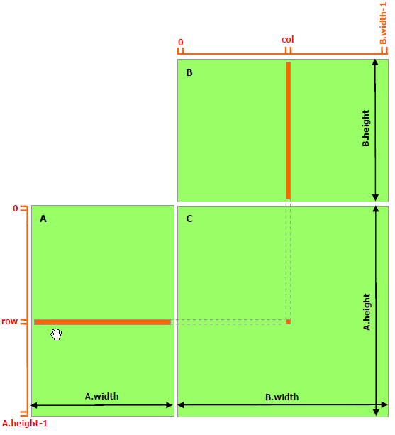

# Chapter 4 - 内存

## 设备内存

CUDA运行时为主机和设备的内存管理提供了一组接口，包括内存分配、释放、数据传输等。设备内存既可以被分配为**线性内存**(*linear memory*)，也可以被分配为**CUDA 数组**(*CUDA arrays*)。其中CUDA数组`cudaArray`是不透明内存布局，我们只能够通过`cudaArray_t`持有其指针。CUDA数组对纹理获取(texture fetching)有着特殊的优化。

线性内存位于设备中的40位地址空间中，可以通过指针进行访问，因此可以实现二叉树等链式结构

对于线性内存，常用的API如下：

```cpp
// 用于分配设备中的线性内存。
// Args:
//   devPtr: 接受分配好的内存空间地址
//   size: 指示数组的长度（字节）
__host__ ​ __device__ ​cudaError_t cudaMalloc ( void** devPtr, size_t size );

// 用于释放设备中内存空间。
// Args:
//   ptr: 待释放的设备内存地址
__host__ ​ __device__ ​cudaError_t cudaFree ( void* devPtr );

// 用于在设备和主机间传输数据。
// Args:
//   dst: 目标地址
//   src: 源地址
//   count: 内存大小（字节）
//   kind: 复制类型
//     cudaMemcpyHostToHost = 0
//     cudaMemcpyHostToDevice = 1
//     cudaMemcpyDeviceToHost = 2
//     cudaMemcpyDeviceToDevice = 3
//     cudaMemcpyDefault = 4 通过指针类型自动推理，需要Unified虚拟地址
__host__ ​cudaError_t cudaMemcpy ( void* dst, const void* src, size_t count, cudaMemcpyKind kind );
```

在此前计算向量加法的程序中，这些函数被多次用到。

```cpp
// ------ code 4.1 ------

// kernel defination...

int main()
{
    // ...

    // allocate for arrays on device
    cudaMalloc(&A, sizeof(float) * N);
    cudaMalloc(&B, sizeof(float) * N);
    cudaMalloc(&C, sizeof(float) * N);

    // copy memory from host to device
    cudaMemcpy(A, host_A, sizeof(float) * N, cudaMemcpyHostToDevice);
    cudaMemcpy(B, host_B, sizeof(float) * N, cudaMemcpyHostToDevice);

    // ...

    // copy result from device to host
    cudaMemcpy(host_C, C, sizeof(float) * N, cudaMemcpyDeviceToHost);

    // deallocate
    cudaFree(A);
    cudaFree(B);
    cudaFree(C);

    // ...

    return 0;
}
```

线性内存也可以通过`cudaMallocPitch`和`cudaMalloc3D`进行分配。建议将这两个函数用于分配2D或3D数组，这样可以保证分配的数组的满足[Device Memory Accesses](https://docs.nvidia.com/cuda/cuda-c-programming-guide/index.html#device-memory-accesses)中的对齐需求，以及让行取值或是2D内存与其他设备内存间的复制(`cudaMemcpy2D`，`cudaMemcpy3D`)获得最好性能。

`cudaMallocPitch`和`cudaMalloc3D`的接口如下接口：

```cpp
// 在设备中分配带有补齐的内存。
// Args:
//  devPtr: 接受分配好的内存空间地址
//  pitch: 接受分配好的每行实际字节数
//  width: 每行至少需要分配的宽度（字节）
//  height: 数组高度（个数）
__host__ ​cudaError_t cudaMallocPitch ( void** devPtr, size_t* pitch, size_t width, size_t height );

// 在设备中分配逻辑上的1D、2D或3D内存对象。
// Args:
//   pitchedDevPtr: 储存分配好的带有补齐的内存空间地址
//   extend: 指定数组维度
__host__ ​cudaError_t cudaMalloc3D ( cudaPitchedPtr* pitchedDevPtr, cudaExtent extent )'
```

其中，结构`cudaPitchedPtr`含有四个成员变量：

```cpp
struct cudaPitchedPtr
{
    size_t pitch; // 对齐后的每行实际宽度
    void* ptr;    // 数组的指针
    size_t xsize; // 逻辑上x上的维度
    size_t ysize; // 逻辑上y的维度
};
```

结构`cudaExtent`通过函数`make_cudaExtent`构造：

```cpp
// 返回一个cudaExtend对象
// Args:
//   w: 每行需要分配的宽度（字节）
//   h: 高度
//   d: 深度
__host__ ​cudaExtent make_cudaExtent ( size_t w, size_t h, size_t d );
```

下面的程序通过`cudaMallocPitch`和 `cudaMalloc3D`分别分配了2D和3D线性数组，可以看到，因为内存补齐的缘故，每一行在内存中实际的宽度与用户指定的并不相同，均被补齐到512字节的整数倍。补齐的具体规则见[Device Memory Accesses](https://docs.nvidia.com/cuda/cuda-c-programming-guide/index.html#device-memory-accesses)。

```cpp
// ------ code 4.2 ------

#include <cstdint>
#include <iostream>

#include <cuda_runtime.h>
#include <device_launch_parameters.h>

int main()
{
    cudaPitchedPtr ptr;

    cudaMallocPitch(&ptr.ptr, &ptr.pitch, 15 * sizeof(float), 15);
    std::cout << ptr.pitch << std::endl;
    cudaFree(ptr.ptr);

    cudaMallocPitch(&ptr.ptr, &ptr.pitch, 128 * sizeof(float), 15);
    std::cout << ptr.pitch << std::endl;
    cudaFree(ptr.ptr);

    cudaMallocPitch(&ptr.ptr, &ptr.pitch, 255 * sizeof(float), 15);
    std::cout << ptr.pitch << std::endl;
    cudaFree(ptr.ptr);

    cudaMalloc3D(&ptr, make_cudaExtent(15 * sizeof(float), 15, 3));
    std::cout << ptr.pitch << " " << ptr.xsize << " " << ptr.ysize << std::endl;
    cudaFree(ptr.ptr);

    cudaMalloc3D(&ptr, make_cudaExtent(128 * sizeof(float), 15, 3));
    std::cout << ptr.pitch << " " << ptr.xsize << " " << ptr.ysize << std::endl;
    cudaFree(ptr.ptr);

    cudaMalloc3D(&ptr, make_cudaExtent(255 * sizeof(float), 15, 3));
    std::cout << ptr.pitch << " " << ptr.xsize << " " << ptr.ysize << std::endl;
    cudaFree(ptr.ptr);

    // Output maybe:
    //512
    //512
    //1024
    //512 60 15
    //512 512 15
    //1024 1020 15

    return 0;
}
```

对于带有对齐的内存空间，最好通过`cudaMemcpy2D`或`cudaMemcpy3D`等函数进行数据传输。这两个函数的的接口如下

```cpp
// 用于在主机、设备复制带有对齐的数据
// Args:
//   dst: 目标
//   dpitch: 目标的pitch，每行实际的宽度（字节）
//   src: 源
//   spitch: 源的pitch（字节）
//   witdh: 待传输矩阵宽度（字节）
//   height: 待传输矩阵高度
//   kind: 传输类型，与cudaMemcpy类似
__host__ ​cudaError_t cudaMemcpy2D ( void* dst, size_t dpitch, const void* src, size_t spitch, size_t width, size_t height, cudaMemcpyKind kind );

// 在3D对象间复制带有对齐的数据
// Args:
//   p: 3D 内存复制参数
__host__ ​cudaError_t cudaMemcpy3D ( const cudaMemcpy3DParms* p );
```

在使用`cudaMemcpy3D`时，首先要将参数用`0`进行初始化，即，例如

```cpp
cudaMemcpy3DParms myParms = {0};
```

在结构`cudaMemcpy3DParms`中，`srcArray`或`srcPtr`必须指定一个且仅指定一个；`dstArray`和`dstPtr`也必须指定一个且仅指定一个。`srcPos`和`dstPos`分别指定了源和目标的起始位移，单位为字节。`extend`定义了要传输的数据区域的维度。`kind`表示传输类型。

下面给出一个使用上述函数的示例程序，改程序计算两个矩阵$A$和$B$的乘积$C=AB$。

```cpp
// ------ code 4.3 ------

#include <cstdint>
#include <iostream>

#include <cuda_runtime.h>
#include <device_launch_parameters.h>

#include "cuda_call.h"

struct Matrix 
{
    size_t rows;
    size_t cols;
    float* elements;
    size_t stride;
};

__device__ float get_element(const Matrix A, size_t row, size_t col)
{
    return A.elements[row * A.stride + col];
}

__device__ void set_element(Matrix A, size_t row, size_t col, float value)
{
    A.elements[row * A.stride + col] = value;
}

__global__ void mat_mul_kernel(const Matrix A, const Matrix B, Matrix C)
{
    size_t row = blockIdx.y * blockDim.y + threadIdx.y;
    size_t col = blockIdx.x * blockDim.x + threadIdx.x;

    float result = 0.0f;
    size_t N = B.rows;

    for (size_t i = 0; i < N; i++)
    {
        result += get_element(A, row, i) * get_element(B, i, col);
    }

    set_element(C, row, col, result);
}

void mat_mul(const Matrix& A, const Matrix& B, Matrix& C);

const size_t M = 480, N = 640, P = 320;

float host_A[M][N], host_B[N][P], host_C[M][P];

int main()
{
    for (int i = 0; i < M; i++)
    {
        for (int j = 0; j < N; j++)
        {
            host_A[i][j] = i == j ? 1.0 : 0.0;
        }
    }

    for (int i = 0; i < N; i++)
    {
        for (int j = 0; j < P; j++)
        {
            host_B[i][j] = i == j ? 1.0 : 0.0;
        }
    }

    Matrix A{ M, N, reinterpret_cast<float*>(host_A) };
    Matrix B{ N, P, reinterpret_cast<float*>(host_B) };
    Matrix C{ M, P, reinterpret_cast<float*>(host_C) };

    mat_mul(A, B, C);

    for (int i = 0; i < M / 10; i++)
    {
        for (int j = 0; j < P / 10; j++)
        {
            std::cout << host_C[i][j] << " ";
        }
        std::cout << std::endl;
    }

    // Output maybe:
    // 1 0 0 0 ...
    // 0 1 0 0 ...
    // 0 0 1 0 ...
    // ...
    // until to (32, 32)
    // after: all zero

    return 0;
}

void mat_mul(const Matrix& A, const Matrix& B, Matrix& C)
{
    size_t M = A.rows, N = B.rows, P = B.cols;

    cudaPitchedPtr ptr_A, ptr_B, ptr_C;

    // allocation by cudaMallocPitch
    ptr_A.xsize = N * sizeof(float);
    ptr_A.ysize = M;
    cc(cudaMallocPitch(&ptr_A.ptr, &ptr_A.pitch, ptr_A.xsize, ptr_A.ysize));

    // allocation by cudaMalloc3D
    cc(cudaMalloc3D(&ptr_B, make_cudaExtent(P * sizeof(float), N, 1)));
    cc(cudaMalloc3D(&ptr_C, make_cudaExtent(P * sizeof(float), M, 1)));

    // memcpy by cudaMemcpy2D
    cc(cudaMemcpy2D(ptr_A.ptr, ptr_A.pitch, A.elements, sizeof(float) * N, sizeof(float) * N, M, cudaMemcpyHostToDevice));
    cc(cudaMemcpy2D(ptr_B.ptr, ptr_B.pitch, B.elements, sizeof(float) * P, sizeof(float) * P, N, cudaMemcpyHostToDevice));

    dim3 dim_block = { 16, 16 };
    dim3 dim_grid = { uint32_t(P / dim_block.x), uint32_t(M / dim_block.y) };

    Matrix kernel_call_A = Matrix{ M, N, reinterpret_cast<float*>(ptr_A.ptr), size_t(ptr_A.pitch / sizeof(float)) };
    Matrix kernel_call_B = Matrix{ N, P, reinterpret_cast<float*>(ptr_B.ptr), size_t(ptr_B.pitch / sizeof(float)) };
    Matrix kernel_call_C = Matrix{ M, P, reinterpret_cast<float*>(ptr_C.ptr), size_t(ptr_C.pitch / sizeof(float)) };

    mat_mul_kernel<<<dim_grid, dim_block >>> (kernel_call_A, kernel_call_B, kernel_call_C);

    cc(cudaDeviceSynchronize());

    // memcpy by cudaMemcpy3D
    cudaMemcpy3DParms cpy_3d_parms_for_C = { 0 };
    cpy_3d_parms_for_C.dstPtr = cudaPitchedPtr{ C.elements, sizeof(float) * P, sizeof(float) * P, M };
    cpy_3d_parms_for_C.dstPos = { 0, 0, 0 };
    cpy_3d_parms_for_C.srcPtr = ptr_C;
    cpy_3d_parms_for_C.srcPos = { 0, 0, 0 };
    cpy_3d_parms_for_C.extent = make_cudaExtent(sizeof(float) * P, M, 1);
    cpy_3d_parms_for_C.kind = cudaMemcpyDeviceToHost;
    cc(cudaMemcpy3D(&cpy_3d_parms_for_C));

    cc(cudaFree(ptr_A.ptr));
    cc(cudaFree(ptr_B.ptr));
    cc(cudaFree(ptr_C.ptr));
}
```

代码中的`cc`是一个自定义的宏，用于检测CUDA API的调用结果是否正确，可以在[附录A](./cuda_appendix_A.md)中找到说明。

上述代码中，每个线程独立计算矩阵$C$中的一个元素，每次计算需要获取$A$的第`row`行，$B$的第`col`的所有元素进行相乘、累加。如下图所示。

> 图 matrix multiplication without shared memory.png
> 
> 


除使用`cudaMalloc`在设备中分配内存空间外，还可以通过`__device__`声明设备中的变量，用`__constant__`声明设备中的常量。

```c++
// ------ code 4.4 ------

__constant__ float constData[256];
float data[256];
cudaMemcpyToSymbol(constData, data, sizeof(data));
cudaMemcpyFromSymbol(data, constData, sizeof(data));

__device__ float devData;
float value = 3.14f;
cudaMemcpyToSymbol(devData, &value, sizeof(float));

__device__ float* devPointer;
float* ptr;
cudaMalloc(&ptr, 256 * sizeof(float));
cudaMemcpyToSymbol(devPointer, &ptr, sizeof(ptr));
```

在上述代码中，出现了两个新的复制数据的方法。`cudaMemcpyToSymbol`和`cudaMemcpyFromSymbol`，它们与`cudaMemcpy`的区别在于其首个参数为设备全局或常量内存空间中的**符号**(*symbol*)，而非地址。此外，这两个函数还可以接受偏移量作为参数。

## 共享内存

此前提到，线程块中的所有线程可以访问同一块由用户管理的共享内存，这个内存空间有望更贴近处理器，因此可能会具有更快的访问速度。因此，要尽可能地将访问全局内存变为访问共享内存。

观察代码4.3，在计算矩阵乘法时需要获取矩阵$A$第`row`行，矩阵$B$第`col`的所有元素，每次访问都发生在全局内存之中，这是一种非常低效的存取方式。现在，考虑将矩阵$C$的乘法分块执行。

如下图所示。将矩阵$C$分割为若干个不重叠的，大小为$BLOCK\_SIZE \times BLOCK\_SIZE$的方形的子矩阵$C_{sub}$。为了计算一个$C_{sub}$中的所有元素，需要获取$A$中对应的`blockDim.y`行，$B$中对应的`blockDim.x`列。同样的，$A$和$B$也做如此分解。此时，矩阵乘法中一个元素的计算，由原来两个完整的向量的内积变为了多对向量的内积之和。

> 图 matrix multiplication with shared memory
>
> 

此时，每次乘法都在$A$的子矩阵和$B$的子矩阵之间进行，这两个子矩阵足够小，可以放入共享内存之中。如何将子矩阵载入共享内存中呢？假设当前的线程块的索引为`blockIdx`，正在进行计算的是$A$中第`blockIdx.y`条，也就是第`blockIdx.y * blockDim.y`到`blockIdx.(y + 1) * blockDim.y - 1`行的第`i`块，和$B$中对应的第`i`块的乘法。在分配好两个大小为`blockDim.x * blockDim.y`的共享内存之后，分别用每个线程去载入两个子矩阵的第`threadIdx`个元素。应该注意到，我们不能假设所有的线程都恰好同时完成载入，因此需要通过函数`__syncthreads`进行同步。在同步完成后，我们可以将子矩阵对应元素矩阵乘法的结果加到一个线程私有的累加器中。需要注意的是，一个线程完成了向量乘法，其他线程可能尚未完成，而它利用的数据会被其他线程继续使用，如果此时就让该线程进行下一次数据加载操作，会导致数据不一致，因此，这里也需要一个`__syncthreads`进行线程同步。在完成所有块的加法后，我们累加器的结果存储到矩阵`C`中。

使用代码4.3中的方法，全局内存的访问是$2MPN+MP$次，新的方法将它降低到$2MPN / BLOCK\_SIZE+MP$次。

代码4.5展示了这种方法。

```cpp
// ------ code 4.5 ------

#include <cstdint>
#include <iostream>

#include <cuda_runtime.h>
#include <device_launch_parameters.h>

#include "cuda_call.h"

struct Matrix 
{
    size_t rows;
    size_t cols;
    float* elements;
    size_t stride;
};

__device__ float get_element(const Matrix A, size_t row, size_t col)
{
    return A.elements[row * A.stride + col];
}

__device__ void set_element(Matrix A, size_t row, size_t col, float value)
{
    A.elements[row * A.stride + col] = value;
}

template <size_t BLOCK_SIZE>
__device__ Matrix get_sub_matrix(Matrix A, size_t upper, size_t left)
{
    return Matrix{ BLOCK_SIZE, BLOCK_SIZE, A.elements + upper * BLOCK_SIZE * A.stride + left * BLOCK_SIZE, A.stride };
}

template <size_t BLOCK_SIZE>
__global__ void mat_mul_kernel(const Matrix A, const Matrix B, Matrix C)
{
    size_t block_row = blockIdx.y;
    size_t block_col = blockIdx.x;

    size_t row = threadIdx.y;
    size_t col = threadIdx.x;

    float result = 0.0f;
    size_t N = B.rows;
    size_t N_block = B.rows / BLOCK_SIZE;

    Matrix C_sub = get_sub_matrix<BLOCK_SIZE>(C, block_row, block_col);

    for (size_t i = 0; i < N_block ; i++)
    {
        // A's sub matrix
        __shared__ float As[BLOCK_SIZE][BLOCK_SIZE];
        // B's sub matrix
        __shared__ float Bs[BLOCK_SIZE][BLOCK_SIZE];

        Matrix A_sub = get_sub_matrix<BLOCK_SIZE>(A, block_row, i);
        Matrix B_sub = get_sub_matrix<BLOCK_SIZE>(B, i, block_col);

        As[row][col] = get_element(A_sub, row, col);
        Bs[row][col] = get_element(B_sub, row, col);

        __syncthreads();

        for (size_t j = 0; j < BLOCK_SIZE; j++)
        {
            result += As[row][j] * Bs[j][col];
        }

        __syncthreads();
    }

    set_element(C_sub, row, col, result);
}

void mat_mul(const Matrix& A, const Matrix& B, Matrix& C);

const size_t M = 480, N = 640, P = 320;

float host_A[M][N], host_B[N][P], host_C[M][P];

int main()
{

    for (int i = 0; i < M; i++)
    {
        for (int j = 0; j < N; j++)
        {
            host_A[i][j] = i == j ? 1.0 : 0.0;
        }
    }

    for (int i = 0; i < N; i++)
    {
        for (int j = 0; j < P; j++)
        {
            host_B[i][j] = i == j ? 1.0 : 0.0;
        }
    }

    Matrix A{ M, N, reinterpret_cast<float*>(host_A) };
    Matrix B{ N, P, reinterpret_cast<float*>(host_B) };
    Matrix C{ M, P, reinterpret_cast<float*>(host_C) };

    mat_mul(A, B, C);

    for (int i = 0; i < M / 10; i++)
    {
        for (int j = 0; j < P / 10; j++)
        {
            std::cout << host_C[i][j] << " ";
        }
        std::cout << std::endl;
    }

    // Output maybe:
    // 1 0 0 0 ...
    // 0 1 0 0 ...
    // 0 0 1 0 ...
    // ...
    // until to (32, 32)
    // after: all zero

    return 0;
}

void mat_mul(const Matrix& A, const Matrix& B, Matrix& C)
{
    size_t M = A.rows, N = B.rows, P = B.cols;

    cudaPitchedPtr ptr_A, ptr_B, ptr_C;

    // allocation by cudaMallocPitch
    ptr_A.xsize = N * sizeof(float);
    ptr_A.ysize = M;
    cc(cudaMallocPitch(&ptr_A.ptr, &ptr_A.pitch, ptr_A.xsize, ptr_A.ysize));

    // allocation by cudaMalloc3D
    cc(cudaMalloc3D(&ptr_B, make_cudaExtent(P * sizeof(float), N, 1)));
    cc(cudaMalloc3D(&ptr_C, make_cudaExtent(P * sizeof(float), M, 1)));

    // memcpy by cudaMemcpy2D
    cc(cudaMemcpy2D(ptr_A.ptr, ptr_A.pitch, A.elements, sizeof(float) * N, sizeof(float) * N, M, cudaMemcpyHostToDevice));
    cc(cudaMemcpy2D(ptr_B.ptr, ptr_B.pitch, B.elements, sizeof(float) * P, sizeof(float) * P, N, cudaMemcpyHostToDevice));

    const size_t BLOCK_SIZE = 16;

    dim3 dim_block = { 16, 16 };
    dim3 dim_grid = { uint32_t(P / dim_block.x), uint32_t(M / dim_block.y) };

    Matrix kernel_call_A = Matrix{ M, N, reinterpret_cast<float*>(ptr_A.ptr), size_t(ptr_A.pitch / sizeof(float)) };
    Matrix kernel_call_B = Matrix{ N, P, reinterpret_cast<float*>(ptr_B.ptr), size_t(ptr_B.pitch / sizeof(float)) };
    Matrix kernel_call_C = Matrix{ M, P, reinterpret_cast<float*>(ptr_C.ptr), size_t(ptr_C.pitch / sizeof(float)) };

    mat_mul_kernel<BLOCK_SIZE><<<dim_grid, dim_block >>> (kernel_call_A, kernel_call_B, kernel_call_C);

    cc(cudaDeviceSynchronize());

    // memcpy by cudaMemcpy3D
    cudaMemcpy3DParms cpy_3d_parms_for_C = { 0 };
    cpy_3d_parms_for_C.dstPtr = cudaPitchedPtr{ C.elements, sizeof(float) * P, sizeof(float) * P, M };
    cpy_3d_parms_for_C.dstPos = { 0, 0, 0 };
    cpy_3d_parms_for_C.srcPtr = ptr_C;
    cpy_3d_parms_for_C.srcPos = { 0, 0, 0 };
    cpy_3d_parms_for_C.extent = make_cudaExtent(sizeof(float) * P, M, 1);
    cpy_3d_parms_for_C.kind = cudaMemcpyDeviceToHost;
    cc(cudaMemcpy3D(&cpy_3d_parms_for_C));

    cc(cudaFree(ptr_A.ptr));
    cc(cudaFree(ptr_B.ptr));
    cc(cudaFree(ptr_C.ptr));
}
```

对于代码4.3和4.5，我们在一个GTX 970显卡上进行了测试。当设$M=4800$，$N=6400$，$P=3200$，$BLOCK\_SIZE = 16$时，代码4.3和4.5的kernel call运行时间分别为102.90秒和35.46秒，加速比为2.90，运行时间减少了67.44秒。